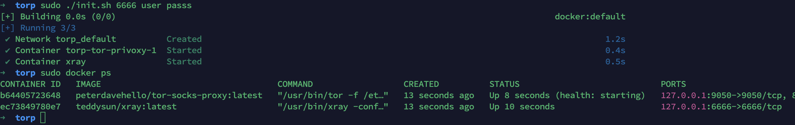
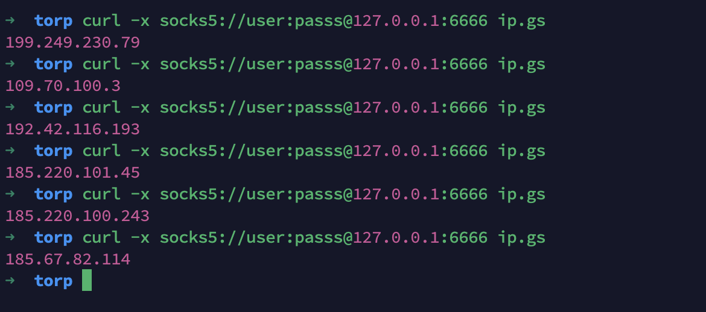

# 一键搭建动态代理
## 利用Tor实现动态代理
### Torrc
主要配置如下:
```
SOCKSPort 0.0.0.0:9050 # Bind to this address:port too.
SOCKSPort 0.0.0.0:38801 #这里开启多个tor端口，对于tor来说，每个端口会使用不同的链路，也就是不同的代理IP
SOCKSPort 0.0.0.0:38802
SOCKSPort 0.0.0.0:38803
SOCKSPort 0.0.0.0:38804
SOCKSPort 0.0.0.0:38805
SOCKSPort 0.0.0.0:38806
SOCKSPort 0.0.0.0:38807
SOCKSPort 0.0.0.0:38808
SOCKSPort 0.0.0.0:38809
SOCKSPort 0.0.0.0:38810

NewCircuitPeriod 30 #对于每个端口来说，每30秒重新创建一个新链路，也就是换一个新IP
CircuitBuildTimeout 10 #对于新建每个链路的过程来说，建立程序超过10秒则直接放弃，保障了连接到线路的质量
```

### xray
利用xray的对不同协议的支持，以及inbound，outbound的灵活性，配置出站连接使用tor的socks,相关配置如下：
```json
{
    "protocol": "socks",
    "settings": {
    "servers": [
        {
        "address": "tor-privoxy",
        "port": 38801
        },
        {
        "address": "tor-privoxy",
        "port": 38802
        },
        {
        "address": "tor-privoxy",
        "port": 38803
        },
        {
        "address": "tor-privoxy",
        "port": 38804
        },
        {
        "address": "tor-privoxy",
        "port": 38805
        },
        {
        "address": "tor-privoxy",
        "port": 38806
        },
        {
        "address": "tor-privoxy",
        "port": 38807
        },
        {
        "address": "tor-privoxy",
        "port": 38808
        },
        {
        "address": "tor-privoxy",
        "port": 38809
        },
        {
        "address": "tor-privoxy",
        "port": 38810
        }
    ]
    },
    "tag": "socks_out"
}
```
再配置代理规则，则可实现通过tor进行代理，规则配置所有domain和ip
```json
{
    "domain": [
        "regexp:.*"
    ],
    "outboundTag": "socks_out",
    "type": "field"
    },
    {
    "ip": [
        "0.0.0.0/0",
        "::/0"
    ],
    "outboundTag": "socks_out",
    "type": "field"
},
```

## 部署
部署方式使用docker部署，只需一条命令即可
```bash
sudo ./init.sh 6666             #在6666端口开启socks5端口，无认证
sudo ./init.sh 6666 user pass   #在6666端口开启socks5端口，帐号密码认证，帐号密码为: user/pass
```



## 使用
使用方式为正常的socks5使用方法，请求ip为tor的ip，示例如下：

